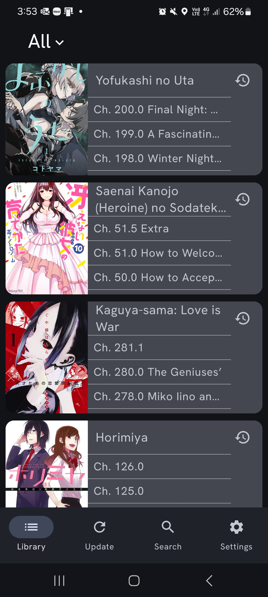

# Mangnet 
  

  

  
Mangnet is a Android native manga reading app inspired by Tachiyomi (RIP 🙏), so far it reads off of Mangadex's REST API to provide a way to download and read manga, allowing a few customizations to the search parameters, genre filtering etc.

# Installation
The releases are able to be found in the releases tab of this repository but notable releases will be linked below:
- Beta release 0.5 - [Mangnet.apk](https://github.com/marcusasdgg/Mangnet/releases/download/v1.0.106/app-release.apk)
- Official release 1.1 [Mangnet.apk](https://github.com/marcusasdgg/Mangnet/releases/tag/v1.1)
- Official release 1.4 (bug fixes) [Mangnet.apk](https://github.com/marcusasdgg/Mangnet/releases/tag/v1.1.4)

# License
[MIT](https://choosealicense.com/licenses/mit/)

# Current Supported features
- Searching for manga listings by name via Mangadex
- filtering manga listings by tag/genres via Mangadex
- filtering manga listings via content rating and Target Demographic via Mangadex
- Reading chapters via Mangadex
- Extra Source support Manganato, supports same features of Mangadex
- Downloading chapters to storage for offline reading
- offline searching and filtering of library.
- periodic as well as forced updates to check for new chapters in library
- Storing manga reading history for easy continuation of reading.
- Manwhua/long form reading support.

# App design

# Support
If anybody has any issues or suggested critisicm/features email me at marcusolachan@gmail.com

# Contributions
Anybody that wants to contribute is free to make a pull request or email me at marcusolachan@gmail.com

# Acknowledgement
I would like acknowledge the MangaDex developers for creating a open source free to use API for accessing their rich library of manga, I would also like to thank all of you who end up at this page and download the app.

# Author notes and project reasoning
Hello guys, my name is Marcus and I am a second year Computer Science student based in Australia, This project all started when at the start of 2024 when I wanted to do a coding project to place in my portfolio for future use, I have seen to many people and peers just copy projects off of youtube boiler plate portfolio projects and that just didn't seem right to me. 

I wanted to make something that I wouldn't just throw away after making, I wanted to create something meaningful, something I could use myself. At the same time however, Tachiyomi was wiped off the face of the Earth and I decided why not make a manga reading app? Obviously as a student fresh off of 1st year I was unable to do anything meaningful, not even knowing what a REST api was or state management. However over the long course of this project's development I learnt those skills via youtube videos and Google's Android Compose courses, allowing me to even have a slight grasp at what this project might look like.

Overall, I hope you guys are happy with this project, if you ever have the time to provide feedback do not hesistate and email [me](marcusolachan@gmail.com)

# Roadmap
In the future I will be adding notification support as well as support for reading manga off of other sources other than mangadex.

# Project Status
Since I am the only person developing this app right now, progress will be slow as I am juggling this project and Uni at the same time.

